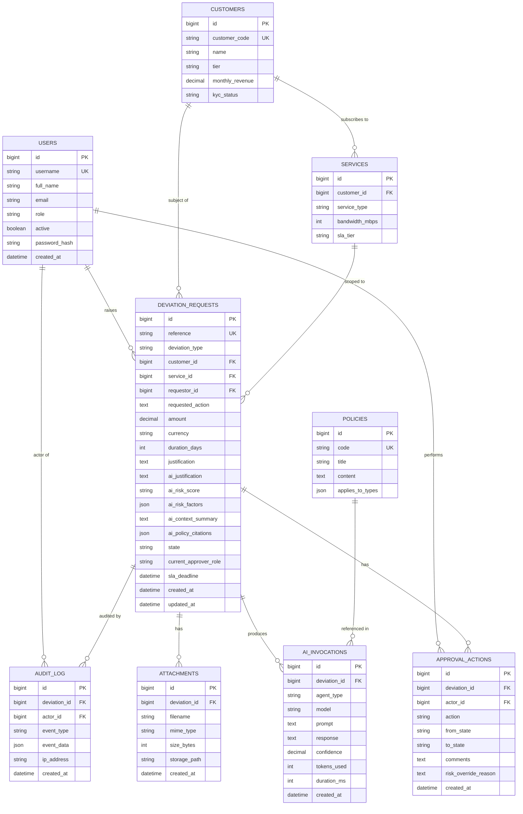

# Database Design — SDA Workflow

> **DBMS**: PostgreSQL 15+ (production), SQLite 3 (dev/demo).  
> **Naming**: snake_case tables and columns. PKs are `id BIGSERIAL`. Timestamps in UTC.

---

## 1. Logical Data Model (Entities & Relationships)



---

## 2. Physical Data Model (DDL)

### 2.1 Users

```sql
CREATE TABLE users (
    id              INTEGER PRIMARY KEY AUTOINCREMENT,
    username        TEXT    NOT NULL UNIQUE,
    full_name       TEXT    NOT NULL,
    email           TEXT    NOT NULL,
    role            TEXT    NOT NULL CHECK (role IN
                      ('REQUESTOR','L1_APPROVER','FINANCE_APPROVER',
                       'NETWORK_APPROVER','COMPLIANCE_APPROVER','AUDITOR','ADMIN')),
    active          INTEGER NOT NULL DEFAULT 1,
    password_hash   TEXT    NOT NULL,
    created_at      DATETIME NOT NULL DEFAULT CURRENT_TIMESTAMP
);
CREATE INDEX idx_users_role ON users(role);
```

### 2.2 Customers & Services

```sql
CREATE TABLE customers (
    id               INTEGER PRIMARY KEY AUTOINCREMENT,
    customer_code    TEXT    NOT NULL UNIQUE,
    name             TEXT    NOT NULL,
    tier             TEXT    NOT NULL CHECK (tier IN ('BRONZE','SILVER','GOLD','PLATINUM')),
    monthly_revenue  REAL    NOT NULL DEFAULT 0,
    kyc_status       TEXT    NOT NULL DEFAULT 'VERIFIED'
                      CHECK (kyc_status IN ('VERIFIED','PENDING','DEFERRED','EXPIRED'))
);

CREATE TABLE services (
    id              INTEGER PRIMARY KEY AUTOINCREMENT,
    customer_id     INTEGER NOT NULL REFERENCES customers(id),
    service_type    TEXT    NOT NULL CHECK (service_type IN
                     ('MOBILE','BROADBAND','ENTERPRISE','MEDIA_STREAMING')),
    bandwidth_mbps  INTEGER NOT NULL DEFAULT 0,
    sla_tier        TEXT    NOT NULL DEFAULT 'STANDARD'
);
CREATE INDEX idx_services_customer ON services(customer_id);
```

### 2.3 Deviation Requests

```sql
CREATE TABLE deviation_requests (
    id                       INTEGER PRIMARY KEY AUTOINCREMENT,
    reference                TEXT    NOT NULL UNIQUE,
    deviation_type           TEXT    NOT NULL CHECK (deviation_type IN
                              ('DT_BILL_CR','DT_DATA_BW','DT_SLA_WV','DT_CONTENT','DT_KYC_DF')),
    customer_id              INTEGER NOT NULL REFERENCES customers(id),
    service_id               INTEGER REFERENCES services(id),
    requestor_id             INTEGER NOT NULL REFERENCES users(id),
    requested_action         TEXT    NOT NULL,
    amount                   REAL,
    currency                 TEXT    NOT NULL DEFAULT 'USD',
    duration_days            INTEGER,
    justification            TEXT    NOT NULL,
    ai_justification         TEXT,
    ai_risk_score            TEXT CHECK (ai_risk_score IN ('LOW','MEDIUM','HIGH')),
    ai_risk_factors          TEXT,   -- JSON serialized
    ai_context_summary       TEXT,
    ai_policy_citations      TEXT,   -- JSON serialized
    state                    TEXT    NOT NULL DEFAULT 'DRAFT' CHECK (state IN
                              ('DRAFT','SUBMITTED','UNDER_REVIEW','INFO_REQUESTED',
                               'APPROVED_L1','APPROVED_L2','FINAL_APPROVED',
                               'EXECUTED','REJECTED','EXPIRED','WITHDRAWN','ESCALATED')),
    current_approver_role    TEXT,
    sla_deadline             DATETIME,
    created_at               DATETIME NOT NULL DEFAULT CURRENT_TIMESTAMP,
    updated_at               DATETIME NOT NULL DEFAULT CURRENT_TIMESTAMP
);
CREATE INDEX idx_dev_state    ON deviation_requests(state);
CREATE INDEX idx_dev_requestor ON deviation_requests(requestor_id);
CREATE INDEX idx_dev_customer  ON deviation_requests(customer_id);
CREATE INDEX idx_dev_created   ON deviation_requests(created_at DESC);
```

### 2.4 Approval Actions

```sql
CREATE TABLE approval_actions (
    id                    INTEGER PRIMARY KEY AUTOINCREMENT,
    deviation_id          INTEGER NOT NULL REFERENCES deviation_requests(id),
    actor_id              INTEGER NOT NULL REFERENCES users(id),
    action                TEXT    NOT NULL CHECK (action IN
                           ('SUBMIT','APPROVE','REJECT','REQUEST_INFO',
                            'OVERRIDE_RISK','WITHDRAW','ESCALATE','EXECUTE')),
    from_state            TEXT,
    to_state              TEXT,
    comments              TEXT,
    risk_override_reason  TEXT,
    created_at            DATETIME NOT NULL DEFAULT CURRENT_TIMESTAMP
);
CREATE INDEX idx_action_deviation ON approval_actions(deviation_id);
```

### 2.5 Audit Log (append-only)

```sql
CREATE TABLE audit_log (
    id            INTEGER PRIMARY KEY AUTOINCREMENT,
    deviation_id  INTEGER REFERENCES deviation_requests(id),
    actor_id      INTEGER REFERENCES users(id),
    event_type    TEXT NOT NULL,
    event_data    TEXT,         -- JSON
    ip_address    TEXT,
    created_at    DATETIME NOT NULL DEFAULT CURRENT_TIMESTAMP
);
CREATE INDEX idx_audit_deviation ON audit_log(deviation_id);
CREATE INDEX idx_audit_created   ON audit_log(created_at DESC);
```

### 2.6 AI Invocations

```sql
CREATE TABLE ai_invocations (
    id            INTEGER PRIMARY KEY AUTOINCREMENT,
    deviation_id  INTEGER REFERENCES deviation_requests(id),
    agent_type    TEXT NOT NULL CHECK (agent_type IN
                   ('JUSTIFICATION','RISK_SCORING','CONTEXT_SUMMARY','POLICY_INTERPRETATION')),
    model         TEXT NOT NULL,
    prompt        TEXT NOT NULL,
    response      TEXT NOT NULL,
    confidence    REAL,
    tokens_used   INTEGER,
    duration_ms   INTEGER,
    created_at    DATETIME NOT NULL DEFAULT CURRENT_TIMESTAMP
);
CREATE INDEX idx_ai_deviation ON ai_invocations(deviation_id);
```

### 2.7 Attachments & Policies

```sql
CREATE TABLE attachments (
    id            INTEGER PRIMARY KEY AUTOINCREMENT,
    deviation_id  INTEGER NOT NULL REFERENCES deviation_requests(id),
    filename      TEXT NOT NULL,
    mime_type     TEXT,
    size_bytes    INTEGER,
    storage_path  TEXT NOT NULL,
    created_at    DATETIME NOT NULL DEFAULT CURRENT_TIMESTAMP
);

CREATE TABLE policies (
    id                INTEGER PRIMARY KEY AUTOINCREMENT,
    code              TEXT NOT NULL UNIQUE,
    title             TEXT NOT NULL,
    content           TEXT NOT NULL,
    applies_to_types  TEXT NOT NULL   -- JSON array
);
```

---

## 3. Data Integrity Rules

| Rule | Enforcement |
|---|---|
| Append-only audit | No UPDATE/DELETE endpoints; DB trigger optional in PG. |
| Segregation of duties | App-level check + DB CHECK constraint (actor_id ≠ requestor_id on approve). |
| State transitions | Application-level state machine; invalid transitions raise error. |
| Reference uniqueness | UNIQUE constraint on `reference` column. |
| Cascade behaviour | ON DELETE RESTRICT for FKs (no hard deletes of business data). |

---

## 4. Sample Seed Data

```sql
-- Users (passwords hashed with bcrypt at seed time)
INSERT INTO users (username, full_name, email, role, password_hash) VALUES
('alice',   'Alice Account',     'alice@telco.com',     'REQUESTOR',           '<hash>'),
('bob',     'Bob L1Lead',        'bob@telco.com',       'L1_APPROVER',         '<hash>'),
('finn',    'Finn Finance',      'finn@telco.com',      'FINANCE_APPROVER',    '<hash>'),
('nina',    'Nina Network',      'nina@telco.com',      'NETWORK_APPROVER',    '<hash>'),
('carol',   'Carol Compliance',  'carol@telco.com',     'COMPLIANCE_APPROVER', '<hash>'),
('aud',     'Audra Auditor',     'aud@telco.com',       'AUDITOR',             '<hash>'),
('admin',   'System Admin',      'admin@telco.com',     'ADMIN',               '<hash>');

INSERT INTO customers (customer_code, name, tier, monthly_revenue, kyc_status) VALUES
('CUST-001', 'Acme Industries',    'PLATINUM', 12500.00, 'VERIFIED'),
('CUST-002', 'Globex Media',       'GOLD',      6800.00, 'VERIFIED'),
('CUST-003', 'Initech Telecom',    'SILVER',    2400.00, 'PENDING'),
('CUST-004', 'Wayne Enterprises',  'PLATINUM', 22500.00, 'VERIFIED'),
('CUST-005', 'Stark Networks',     'GOLD',     11200.00, 'VERIFIED');
```

---

## 5. Indexing Strategy

- Filter-heavy views on `state` + `created_at DESC` → composite index `(state, created_at DESC)` recommended in PG.
- Approver dashboards query by `current_approver_role` + `state` → composite index.
- Audit queries by `deviation_id` and date range → covered by single-col indexes.

---

## 6. Migration Notes (SQLite → PostgreSQL)

| Aspect | SQLite | PostgreSQL |
|---|---|---|
| Auto-increment | `INTEGER PRIMARY KEY AUTOINCREMENT` | `BIGSERIAL` or `GENERATED AS IDENTITY` |
| Booleans | INTEGER (0/1) | `BOOLEAN` |
| JSON columns | `TEXT` (serialized) | `JSONB` |
| Timestamps | `DATETIME` | `TIMESTAMPTZ` |
| Check constraints | Inline | Same syntax, supported |
