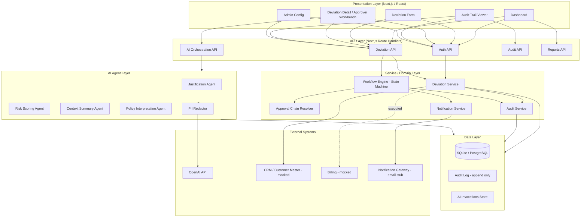
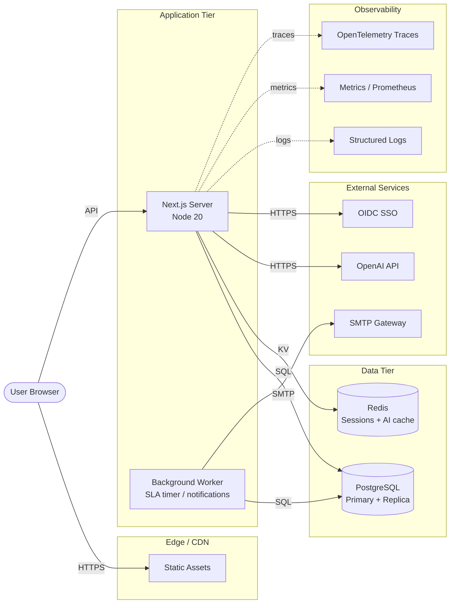
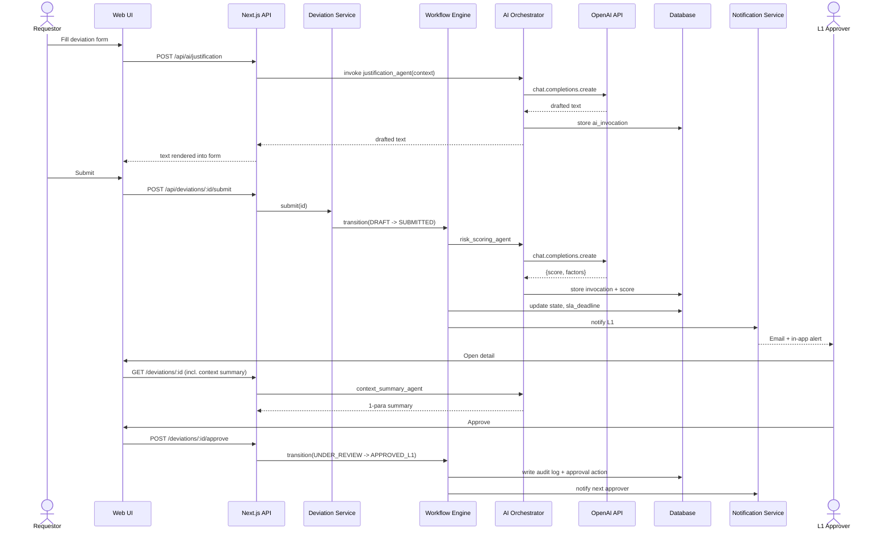
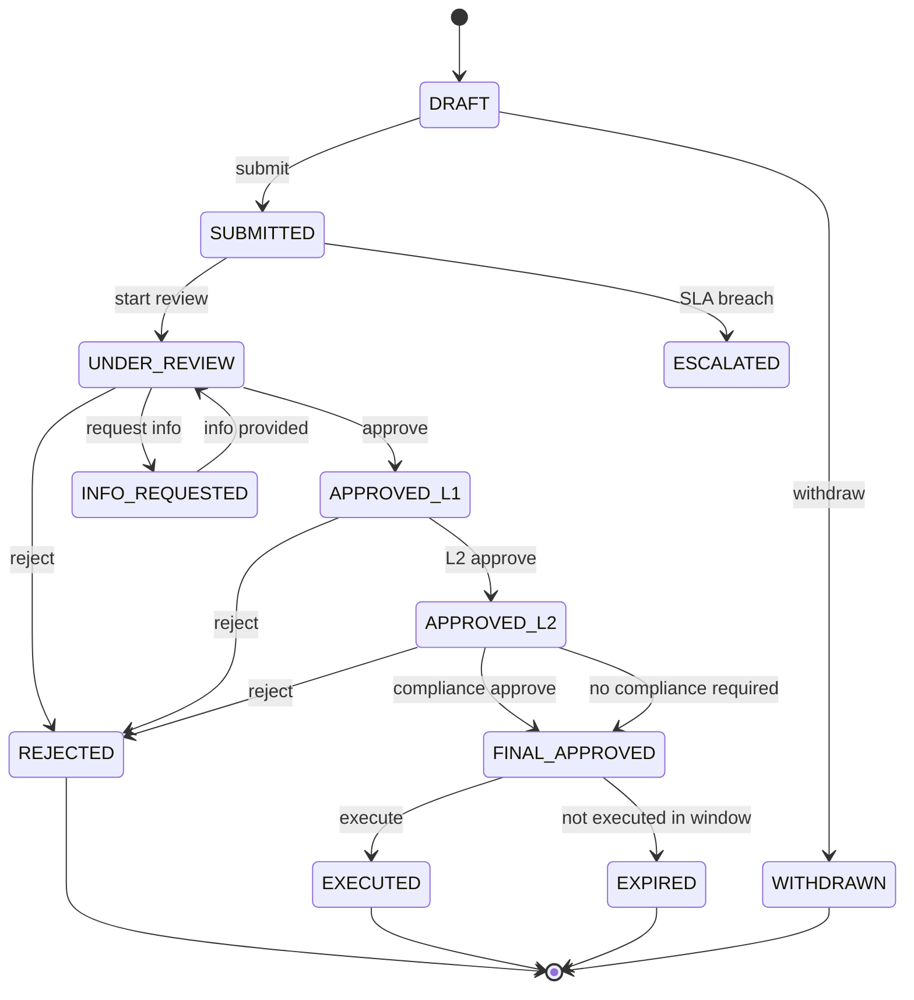
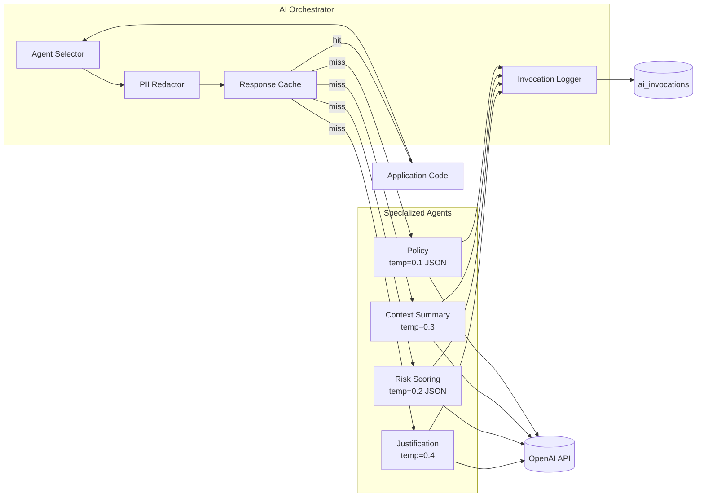
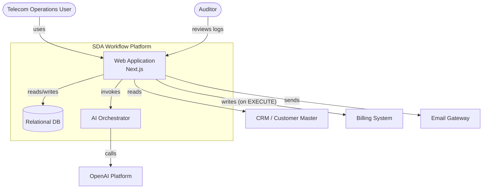

# SDA Workflow — Architecture Diagrams

> All diagrams are written in **Mermaid** for portability. Each can be rendered in GitHub, VS Code (Mermaid plugin), or `mmdc` CLI.

---

## 1. Application Architecture (Layered)

---

## 2. Technical Architecture (Deployment)

---

## 3. End-to-End Sequence — Submit & Approve Flow

---

## 4. State Machine — Deviation Lifecycle

---

## 5. AI Agent Architecture

---

## 6. Component Interaction (C4 — Container Level)

